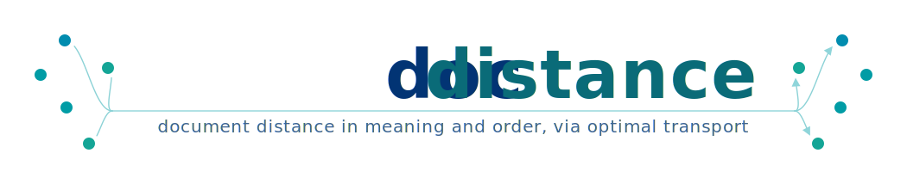

# docdistance

[](https://github.com/stellarshenson/docdistance/actions/workflows/ci.yml)
[](https://pypi.org/project/docdistance/)
[](https://pepy.tech/project/docdistance)

Semantic distance between two documents via Statement Mover's Distance - optimal transport over mmBERT statement embeddings, after Kusner et al. 2015 ([*From Word Embeddings To Document Distances*](references/papers/%5Bpaper%5D%20From%20Word%20Embeddings%20To%20Document%20Distances.pdf)). A thin frontend to the library; the SOTA docs carry the mechanics, benchmarks, and validation.

<p align="center">
  
</p>

- **Input** - two documents, raw text or a file path
- **Output** - an SMD distance, a 0..1 closeness, a verdict, and the statement alignment
- **Use** - agentic document conversion and extraction pipelines, where token logits are unavailable and KL divergence cannot be computed
- **Unit** - statement-level and position-invariant, with an interpretable transport plan

## Theory

A document distance grounded in embeddings and optimal transport, not surface overlap.

- **WMD** - Word Mover's Distance (Kusner et al. 2015) casts document similarity as optimal transport between embedded tokens
- **SMD** - this project lifts it to statements: segment, embed, transport between the two statement clouds
- **Beyond cosine** - whole-document cosine collapses when the same claims sit in a different place or order; statement-level transport is position-invariant
- **Metric** - the ground cost `√(2 − 2cos)` on L2-normalized embeddings is a metric, so the document distance is one too
- **Logit-free** - an embedding-grounded alternative where token probabilities (KL divergence) are unavailable, as in frontier-model pipelines

## Method

Three stages; the transport plan is the interpretable by-product.

1. **Segment** - split each document into atomic statements with the SAT (Segment Any Text) segmenter
2. **Embed** - encode each statement with the mmBERT contextual encoder (mean-pooled, L2-normalized)
3. **Compare** - optimal transport between the two statement clouds (Statement Mover's Distance), optionally unbalanced so added or missing statements are scored, not force-matched

- **Closeness** - `1 − SMD/√2`, on a 0..1 scale
- **Source-conditioned** - a variant `d(A, B | S)` re-bases the transport onto a shared source `S` and reads off a selection axis and a grounding axis

## Which distance

Pick by what the comparison must tell you.

- **One similarity number, fast** - the symmetric distance: sub-millisecond, a true metric, separates faithful from degraded documents
- **Why two documents of one source diverge** - the source-conditioned distance `d(A, B | S)`: a selection axis (cheap, metric) and a grounding axis (a heavy diagnostic) that name whether the difference is dropped content or unsupported content
- **Caveat** - the source-conditioned gain is interpretation and correct ordering of the failure modes, not a higher pass rate; validate on your own sources before relying on it

## Usage

The library is the product; install once, then call it.

```python
from docdistance import document_distance

result = document_distance("report_v1.md", "report_v2.md")
print(result.closeness)  # 0..1 similarity, 1 - SMD/sqrt(2)
print(result.verdict)    # "similar" | "not similar"
```

```bash
make install                                   # environment, package, Jupyter kernel
docdistance install                            # download + cache the models (once)
docdistance distance a.md b.md                 # rich, coloured verdict
docdistance distance a.md b.md --json          # machine-readable JSON
```

- **Offline after install** - distance calls run fully offline once the models are cached
- **Backend** - `--backend openvino|torch`, default `openvino` (CPU INT8)
- **Full API and flags** - `docdistance --help` and the SOTA docs

## Documentation

The SOTA documents explain how it works in detail; this README only introduces it.

- `docs/wmd-docdistance-solution-sota.md` - source-free distance: design, mechanism, performance, validation
- `docs/wmd-source-conditioned-docdistance-solution-sota.md` - source-conditioned distance `d(A,B|S)`: two axes (selection + grounding), design, performance, limitations
- `docs/mmbert-quantization-solution.md` - the INT8 / FP8 statement encoder
- [*From Word Embeddings To Document Distances*](references/papers/%5Bpaper%5D%20From%20Word%20Embeddings%20To%20Document%20Distances.pdf) - Kusner et al. 2015, the WMD theory ([digest](references/papers/from-word-embeddings-to-document-distances.md))
- [*All-but-the-Top: Simple and Effective Postprocessing for Word Representations*](references/papers/%5Bpaper%5D%20All-but-the-Top%3A%20Simple%20and%20Effective%20Postprocessing%20for%20Word%20Representations.pdf) - Mu & Viswanath, ICLR 2018, the anisotropy postprocessing ([digest](references/papers/all-but-the-top-simple-and-effective-postprocessing-for-word-representations.md))

> **Note**: Scaffolded with the [copier-data-science](https://github.com/stellarshenson/copier-data-science) template.
