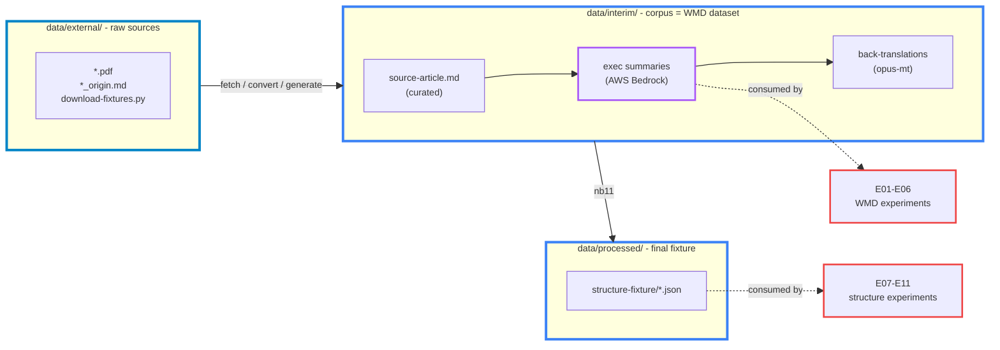

# Dataset Generation Recipe

The project builds two datasets from one foundation: a **WMD / source-conditioned dataset** and a **structure-distance dataset**. Both derive from two third-party source articles and a shared executive-summary corpus generated by AWS Bedrock. Everything downstream of the curated source articles is reproducible from scratch. This is the walkthrough and the rebuild procedure.

## Two datasets

- **WMD / source-conditioned dataset** - the exec-summary corpus at `data/interim/exec-summaries/ibm-ai-adoption/`: the IBM source article plus 11 summaries (7 gold-tier, 4 adversarial). The WMD experiments (E01-E06) read it directly - source-free distance between summaries, and source-conditioned `d(A,B|S)` grounding against the article
- **Structure-distance dataset** - `data/processed/structure-fixture/`: segmented statements, a reorder pool, pair regimes, metadata. Notebook 11 builds it from the corpus plus the Wergeland article. The structure experiments (E07-E11) read it

## Shared foundation: external → source articles → corpus

## Process, step by step

1. **Fetch** the source PDFs into `data/external/` with `download-fixtures.py`
2. **Convert** each PDF into a curated `source-article.md` (pdfplumber per-column extraction + hand-review) under `data/interim/`
3. **Summarise** each source article into executive summaries with AWS Bedrock under the **gold rules** - 7 gold-tier (opus / sonnet / haiku + repeated samples) and 4 adversarial; this is the document corpus (the WMD dataset)
4. **Segment** every document - source and summaries - into atomic statements with SAT
5. **Back-translate** the statements EN → DE → EN with opus-mt for faithful paraphrases - the content-invariance control
6. **Assemble** the reorder pool, pair regimes and metadata into the structure fixture under `data/processed/`

Steps 1-3 produce the WMD dataset; steps 4-6 add the structure dataset. Notebook 11 runs steps 2-6; step 1 is the download script.

- **Source PDFs** (`data/external/`) - fetched by `download-fixtures.py` from the recorded URLs; gitignored binaries, provenance and licence in the matching `*_origin.md`
- **Source articles** (`data/interim/.../source-article.md`) - one curated readable markdown per article; Wergeland is pdfplumber per-column extraction then hand-review, IBM is the curated press-release text; committed canonical inputs
- **Exec-summary corpus (AWS Bedrock)** - generated from the IBM source article: 7 gold-tier under the gold rules across opus 4.5 / sonnet 4.6 / haiku 4.5, plus 4 adversarial. Models resolve from `.env` (`BEDROCK_MODEL_*`, kolomolo, eu-central-1); the prompts are baked into notebook 11; generation is cache-backed. This corpus is the WMD dataset and the base material for the structure dataset

## From source article to summaries - the gold rules

The corpus is created by **converting the source article into executive summaries under a fixed writing contract** - the executive-summary gold rules at [`references/rules/executive-summary-gold-rules.md`](../../references/rules/executive-summary-gold-rules.md). This conversion is the heart of the dataset: it manufactures pairs with a known distance for the metric to be validated against.

- **The gold rules** - a strict contract: lead with the problem, quantified findings ordered by significance, one actionable recommendation, active voice, plain language, no hedging; deliberately clean, declarative sentences that segment into atomic statements
- **Why a contract** - two summaries written from the same source under the same rules are semantically close, so the distance metric is validated against a **known-near pair**; the rules produce that near-pair on purpose
- **Gold-tier corpus (7)** - the source article is summarised under the gold rules by three models (opus 4.5, sonnet 4.6, haiku 4.5) plus repeated opus samples; model diversity and sampling diversity give a spread of faithful summaries that should all read as near
- **Adversarial corpus (4)** - the same article is summarised in two degraded styles that deliberately violate the rules: **adv1** hedged, vague and passive; **adv2** jargon and information overload; same content, bad style - the grounding-intrusion distractors that must not score as gold-near
- **Generation** - AWS Bedrock applies these prompts (baked into notebook 11) to the source article; output is cached per variant, so a rebuild only generates what is missing

## WMD / source-conditioned dataset

- **Content** - the 11 exec summaries plus the IBM source article, consumed directly from `data/interim/exec-summaries/ibm-ai-adoption/`
- **Consumers** - E01 source-free contrast, E02-E05 the source-conditioned two-axis distance (selection `D_sel` + grounding `D_grd`), E06 trained scorers; `notebooks/04` and `05` are the baselines
- **Tiers** - gold (faithful) versus adv1 (hedged) versus adv2 (jargon) drive the grounding-intrusion test: a degraded same-content summary must not score as gold-near
- **Statements** - `notebooks/01` segments the IBM source PDF into `data/interim/01-statements.parquet`, the segmentation demonstrator

## Structure-distance dataset

Notebook 11 runs three stages mirroring the `data/` layout:

- **Stage 1 - External → Interim** - convert the Wergeland PDF, generate the corpus (Bedrock), segment every document into statements
- **Stage 2 - Interim** - opus-mt EN → DE → EN back-translation paraphrases (the content-invariance control), a byte-identical k-swap reorder pool (the order-isolation upper bound), the pair regimes (cross-summary, tier-contrast, paraphrase, section-swap)
- **Stage 3 - Interim → Processed** - write `statements.json`, `reorder_pool.json`, `pairs.json`, `meta.json`

## Executive-summary prompts

The prompts are baked into notebook 11, so the corpus is reproducible without external files.

- **Gold** - mirrors [`executive-summary-gold-rules.md`](../../references/rules/executive-summary-gold-rules.md): lead with the problem, quantified findings ordered by significance, close with one actionable recommendation; active voice, plain language, no hedging
- **adv1 (hedged)** - same content, deliberately hedged, vague and passive ("appears to", "arguably", rounded figures)
- **adv2 (jargon)** - same content, deliberately jargon-laden and information-overloaded
- **Temperature** - 0.4 for the canonical gold anchor, 0.85 for the rest so the multi-sample opus variants diverge
- **Archive** - the previous opus-4-8 corpus is kept at `summaries/@archive/summaries-original/` as the reference set

## Recreate from scratch

Prerequisites:
- `.env` with `HF_AUTH_TOKEN` and the Bedrock config (`BEDROCK_MODEL_OPUS|SONNET|HAIKU`, `AWS_PROFILE`, `AWS_DEFAULT_REGION`)
- AWS Bedrock access on the kolomolo account for the three Anthropic models; a CUDA GPU for opus-mt and SAT segmentation
- the environment installed via `make install` (or `uv sync --extra dev`)

Steps:
1. `python data/external/download-fixtures.py` - fetch the source PDFs into `data/external/`
2. To force a full rebuild, clear the caches: remove `data/interim/exec-summaries/ibm-ai-adoption/summaries/*.md` and `data/interim/structure-paraphrase/*.bt.json`
3. Run notebook 11 end-to-end - it generates the shared exec-summary corpus (Bedrock) that the WMD experiments consume, then the back-translations (opus-mt) and the structure fixture
4. The structure fixture lands in `data/processed/structure-fixture/`; the WMD corpus lands in `data/interim/exec-summaries/`

The curated source articles are committed canonical inputs - hand-reviewed and not machine-reproducible. Everything downstream of them regenerates.

## Notebooks

- [notebooks/11-kj-structure-fixture.ipynb](../../notebooks/11-kj-structure-fixture.ipynb) - generates the shared corpus and builds the structure dataset
- [notebooks/04-kj-wmd-document-distance.ipynb](../../notebooks/04-kj-wmd-document-distance.ipynb) and [notebooks/05-kj-source-conditioned-distance.ipynb](../../notebooks/05-kj-source-conditioned-distance.ipynb) - WMD dataset baselines
- [notebooks/01-kj-document-segmentation.ipynb](../../notebooks/01-kj-document-segmentation.ipynb) - source-PDF segmentation
